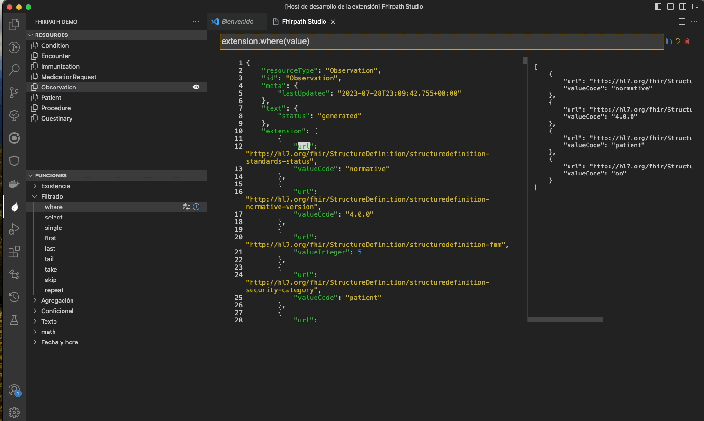

# FhirpathUtil for Visual Studio Code

FhirpathUtil is an open source extension for Visual that implements functions specific to FHIR resource evaluation.

FHIR® is the registered trademark of HL7 and is used with the permission of HL7. Use of the FHIR trademark does not constitute endorsement of this product by HL7.

## Features

 

## For more information

* [Visual Studio Code's Markdown Support](http://code.visualstudio.com/docs/languages/markdown)
* [Markdown Syntax Reference](https://help.github.com/articles/markdown-basics/)

## Other used open source project

- npm fhirpath <https://github.com/HL7/fhirpath.js>
